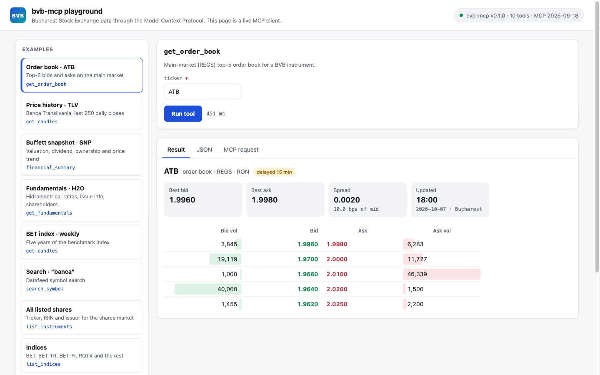
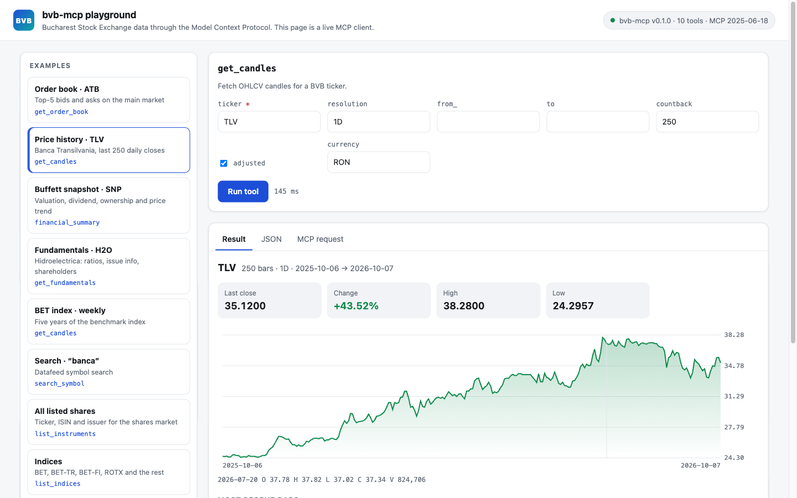
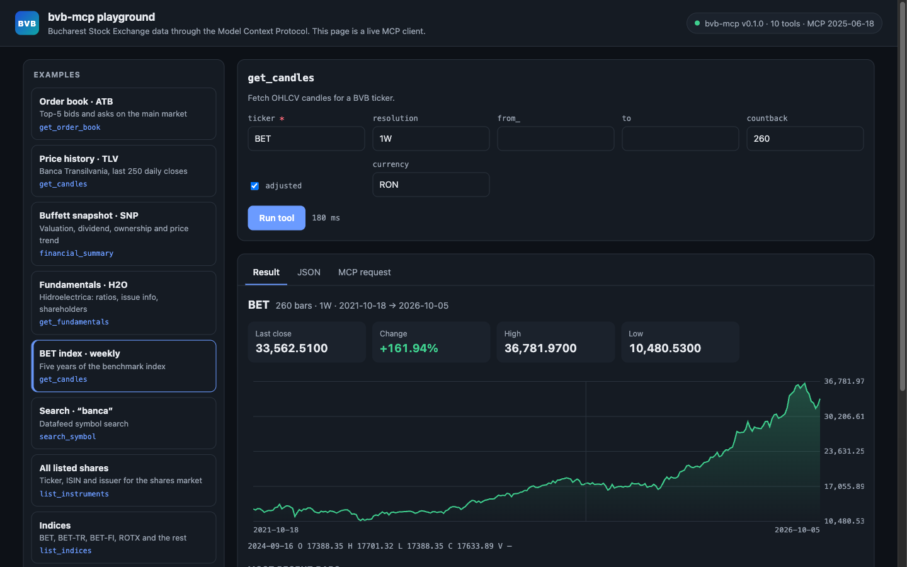
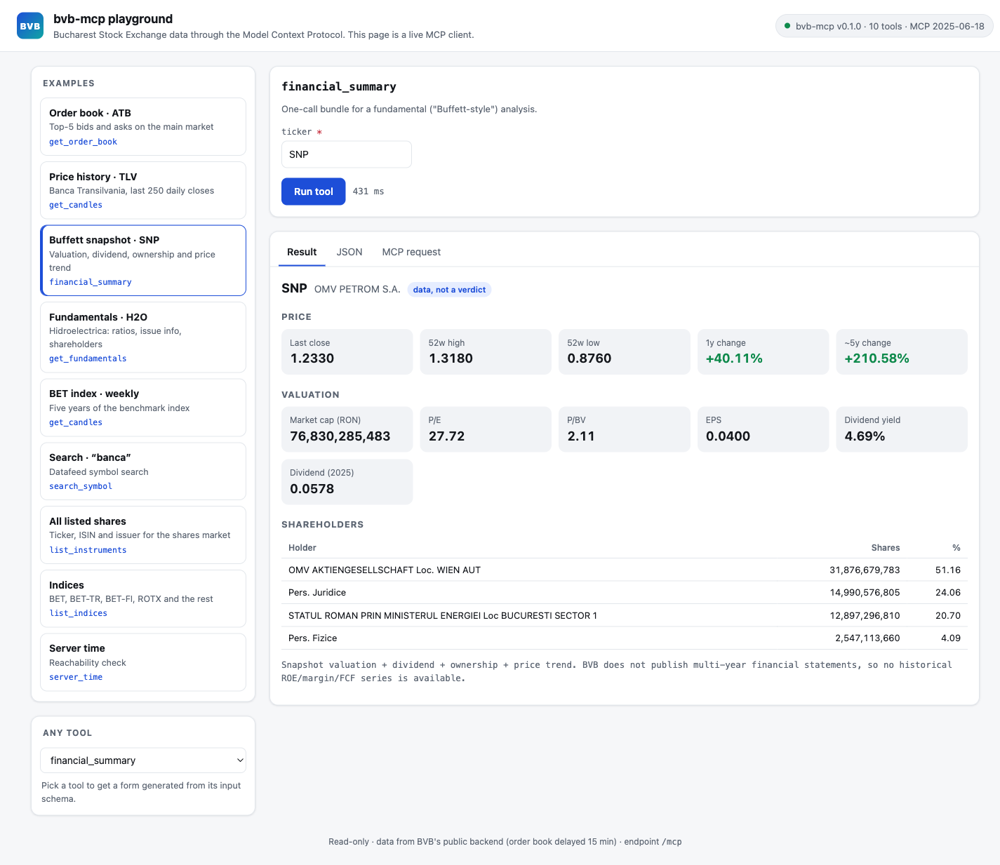
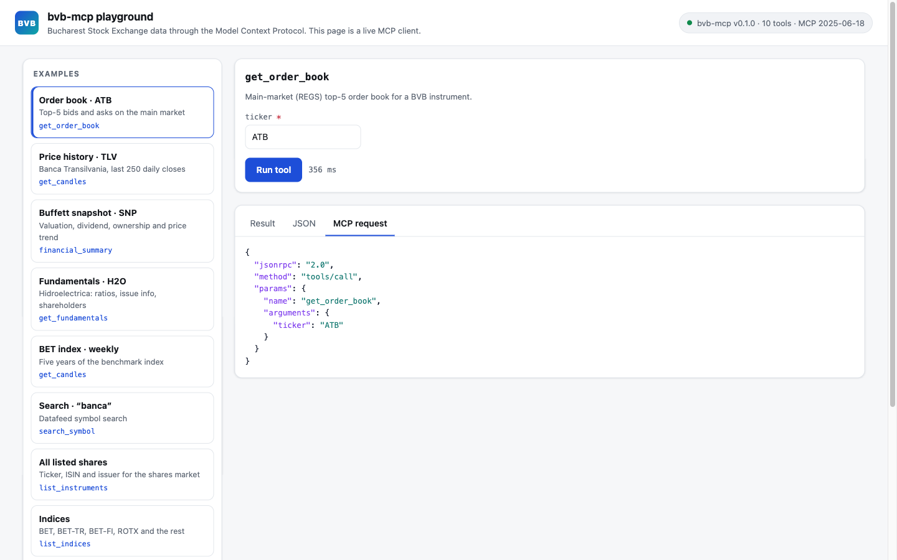

<h1 align="center">bvb-mcp</h1>

<p align="center">
  <b>Bucharest Stock Exchange data for AI assistants and MCP clients.</b><br>
  Prices, order books, fundamentals and the full instrument universe from BVB's own public backend: no account, no API key, read-only.
</p>

<p align="center">
  
  
  
  
  
</p>

<p align="center">
  
</p>

`bvb-mcp` is a [Model Context Protocol](https://modelcontextprotocol.io) server for the
**Bursa de Valori București (BVB)**. It exposes BVB's own public backend as MCP tools:
the TradingView-UDF datafeed at `wapi.bvb.ro` and the server-rendered pages at
`www.bvb.ro`. A built-in **web playground** lets you try every tool from a browser.

## Try it in 30 seconds

```bash
git clone https://github.com/florinel-chis/bvb-mcp && cd bvb-mcp
docker build -t bvb-mcp .
docker run --rm -p 127.0.0.1:8000:8000 bvb-mcp --transport http --host 0.0.0.0 --allow-remote
```

Open **http://127.0.0.1:8000/** and click an example. MCP clients connect to
`http://127.0.0.1:8000/mcp`. If port 8000 is taken, use `-p 127.0.0.1:8010:8000`
and open port 8010 instead.

## The playground

The page at `/` is a **real MCP client**, not a separate API. It talks Streamable
HTTP JSON-RPC to the same server's `/mcp` endpoint:

1. `initialize`
2. `notifications/initialized`
3. `tools/list`
4. `tools/call`

Every result it shows comes through the protocol an AI assistant would use.

- **Examples** for every kind of data: order book, price history, fundamentals,
  search, the instrument universe.
- **Any tool, any argument.** A form is generated from each tool's input schema.
- **Readable results:**
  - an order-book depth ladder with spread;
  - an interactive price chart;
  - valuation cards and shareholder tables;
  - plain tables for lists.

  Each result also has a **JSON** tab and an **MCP request** tab.
- **Self-contained.** It's one HTML file with no external scripts, fonts or
  trackers. Light and dark themes follow your OS.
- **No extra exposure.** It adds no capability beyond `/mcp` itself; pass `--no-ui`
  to serve the MCP endpoint only.

<table>
  <tr>
    <td width="50%"><br><sub><b>Price history:</b> TLV, last 250 daily closes, hover for OHLCV</sub></td>
    <td width="50%"><br><sub><b>Dark mode:</b> BET index, five years of weekly bars</sub></td>
  </tr>
  <tr>
    <td width="50%"><br><sub><b>Fundamental snapshot:</b> SNP price trend, valuation and ownership in one call</sub></td>
    <td width="50%"><br><sub><b>Under the hood:</b> the exact <code>tools/call</code> JSON-RPC request</sub></td>
  </tr>
</table>

## What you can ask

Connected to an MCP-capable assistant, questions like these become tool calls:

- *"Show me the order book for Antibiotice (ATB). How wide is the spread?"* → `get_order_book`
- *"How has Banca Transilvania done over the last year?"* → `get_candles`
- *"Give me a value-investing snapshot of OMV Petrom."* → `financial_summary`
- *"Who are Hidroelectrica's largest shareholders?"* → `get_fundamentals`
- *"List every ETF traded on BVB."* → `list_instruments` with `market="fund-units"`
- *"Plot the BET index weekly since 2021."* → `get_candles` with `ticker="BET"`

## Tools

All ten tools are read-only. There is nothing to trade through here.

| Tool | Description |
|---|---|
| `get_order_book` | Main-market (REGS) top-5 order book: bids/asks as `{price, volume}` levels, `updated_at`, and a `delayed` flag (BVB publishes it 15 min delayed). Replays the detail page's "Tranzactionare" tab postback (two requests) |
| `get_candles` | OHLCV candles for a ticker or index at minute/daily/weekly/monthly resolution. Index bars have `volume: null` |
| `get_fundamentals` | Company details + valuation snapshot scraped from the detail page: identity, Indicatori bursieri (market cap, P/E, P/BV, EPS, div yield, dividend), issue info, and ownership structure |
| `financial_summary` | One-call bundle for a fundamental ("Buffett-style") analysis: `get_fundamentals` + a price summary (last close, 52-week range, 1y/5y change). Returns data, not a verdict |
| `list_instruments` | A market's instrument universe (ticker + ISIN + name), scraped from the BVB market-list page. Markets: `shares`, `bonds`, `fund-units` (ETFs), `warrants`, `certificates` (`structured`) |
| `list_indices` | The BVB index universe (BET, BET-TR, BET-FI, ROTX, …) |
| `search_symbol` | Datafeed symbol search by ticker/name (server-capped at ~30 results) |
| `get_symbol_info` | Resolve a ticker to its metadata: name, type, session, timezone, currency, sector/industry |
| `server_time` | Datafeed server time (reachability check) |
| `datafeed_config` | Datafeed configuration: instrument-type codes and supported resolutions |

### Notes on the data surface

- **Search is capped.** `search_symbol` mirrors the datafeed's own search,
  which returns roughly 30 results for broad queries. Use `list_instruments`
  (or `list_indices`) to enumerate the full universe.
- **The `1D` quirk.** The datafeed advertises a bare `D` for daily bars, but the
  history endpoint only accepts `1D`; a bare `D` returns HTTP 500. `get_candles`
  takes a friendly `resolution` (`1`, `5`, `15`, `30`, `60`, `1D`, `1W`, `1M`, with
  `D`/`W`/`M` accepted too) and sends the correct code.
- **Order book via postback.** The book only renders on the detail page's
  server-side trading tab. `get_order_book` replays that tab's ASP.NET postback.
  It locates everything by visible text (the tab label, the section heading, the
  column headers), never by generated element ids, so a re-rendered page doesn't
  break it.
- **Index metadata is partial.** `list_indices` always returns every index's
  `symbol`, but `name`/`isin` are populated only for the indices BVB renders a
  server-side profile card for. The rest load via client-side tabs and come
  back as `null`.
- **Rights / structured.** BVB publishes no standalone "rights" market page, and
  "structured products" (datafeed type `T`) are split across the `warrants` and
  `certificates` pages. `structured` is accepted as an alias for `certificates`.
- **No multi-year statements.** `get_fundamentals` / `financial_summary` expose
  BVB's current snapshot: valuation ratios, dividend and ownership. BVB does not
  publish structured multi-year income/balance/cash-flow statements, so a full
  10-year ROE/margin/FCF track record is not available. Pair with `get_candles`
  for the price trend; the client does the analysis.

## Connect an MCP client

**stdio via `uvx`**, no install or clone needed:

```json
{
  "mcpServers": {
    "bvb": {
      "command": "uvx",
      "args": ["--from", "git+https://github.com/florinel-chis/bvb-mcp", "bvb-mcp"]
    }
  }
}
```

**stdio via Docker** (build the image first):

```json
{
  "mcpServers": {
    "bvb": {
      "command": "docker",
      "args": ["run", "-i", "--rm", "bvb-mcp"]
    }
  }
}
```

**HTTP:** point any Streamable-HTTP client at `http://127.0.0.1:8000/mcp` while
the server from [Try it in 30 seconds](#try-it-in-30-seconds) is running.

## Running it

From the repository with [uv](https://docs.astral.sh/uv/):

```bash
uvx --from git+https://github.com/florinel-chis/bvb-mcp bvb-mcp                    # stdio
uvx --from git+https://github.com/florinel-chis/bvb-mcp bvb-mcp --transport http   # http://127.0.0.1:8000/
```

| Flag | Default | Meaning |
|---|---|---|
| `--transport` | `stdio` | `stdio` or `http` |
| `--host` | `127.0.0.1` | HTTP bind address. Non-loopback is refused unless `--allow-remote` is also passed |
| `--port` | `8000` | HTTP port |
| `--allow-remote` | off | Permit a non-loopback `--host`. Read [Safety](#safety) first |
| `--no-ui` | off | HTTP: serve only `/mcp`, not the playground at `/` |

### Docker

A small (~200 MB) multi-stage image that runs as a non-root user and works both ways
an MCP client might use it. Both paths have been verified against BVB's live backend.
The container only needs outbound network access to `wapi.bvb.ro` / `www.bvb.ro`; it
needs no credentials or volumes.

```bash
docker build -t bvb-mcp .

# stdio: what an MCP client spawns
docker run -i --rm bvb-mcp

# HTTP: a long-running server with the playground at http://127.0.0.1:8000/
docker run --rm -p 127.0.0.1:8000:8000 bvb-mcp --transport http --host 0.0.0.0 --allow-remote
```

`--host 0.0.0.0` binds inside the container so the port mapping works, which is
why `--allow-remote` is needed. The `127.0.0.1:` prefix on `-p` keeps the
endpoint reachable from this machine only, because it is unauthenticated (see
[Safety](#safety)).

You can also **share the image without a registry**: hand someone a file they can
`docker load`.

```bash
docker save bvb-mcp:latest | gzip > bvb-mcp.tar.gz   # you: export
docker load < bvb-mcp.tar.gz                          # them: image is now local
```

## Configuration

All configuration is via environment variables, and all of it is optional: the
BVB backend needs no credentials.

| Variable | Default | Purpose |
|---|---|---|
| `BVB_DATAFEED_URL` | `https://wapi.bvb.ro` | Datafeed base URL |
| `BVB_WEB_URL` | `https://www.bvb.ro` | Market-list site base URL |
| `BVB_MCP_USER_AGENT` | a Chrome-like UA | `User-Agent` sent on every request |
| `BVB_LANG` | `ro` | Language for the datafeed config endpoint |

Requests carry a browser-like `User-Agent` and `Referer: https://www.bvb.ro/`, and
a single HTTP 429 is retried once, honouring `Retry-After` (capped at 30 s). Under
bursty access BVB can briefly answer `401`; space out large multi-symbol scans.

## Safety

- The HTTP transport, including the playground, has **no authentication**:
  anyone who can reach the port can call every tool. Keep it bound to `127.0.0.1`
  (the CLI default; with Docker, publish as `-p 127.0.0.1:8000:8000`) or put it
  behind an authenticating reverse proxy. Never expose it directly on a public
  network.
- All tools are read-only: this server cannot place orders or move money.
- Use at your own risk. Nothing here is investment advice.

## Data & terms

This server ships **code, not data**. It fetches from BVB's own public backend
at request time and returns whatever BVB serves; the order book is published
15 minutes delayed. Redistributing or otherwise using BVB price data is subject
to BVB's terms and any applicable market-data licensing, and is **your
responsibility** as the operator. The software makes no representation about
your right to store, redistribute, or trade on the data it relays.

## Development

```bash
uv sync
uv run pytest -q
uv run ruff check .
```

Tests are fully offline. HTTP is stubbed with `respx` against captured BVB
responses in `tests/fixtures/`. The playground is tested in-process: it is served
at `/`, self-contained, and every example names a registered tool.

Project layout:

```
src/bvb_mcp/
  server.py        # FastMCP server, CLI flags, playground route
  client.py        # async httpx layer: headers, 429 retry, error mapping
  parse.py         # HTML parsers (market lists, indices, fundamentals, order book)
  tools/           # one module per domain: candles, symbols, universe, fundamentals, orderbook, diagnostics
  web/index.html   # the playground: a single-file MCP client
```

## License

MIT
